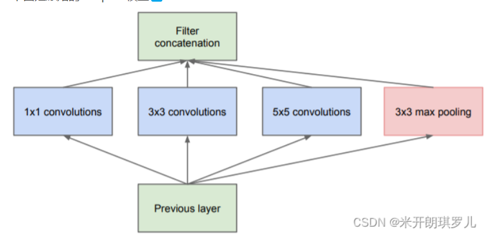
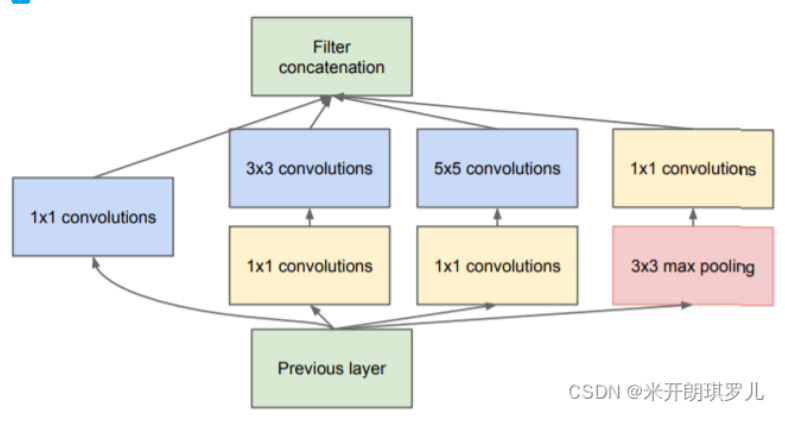
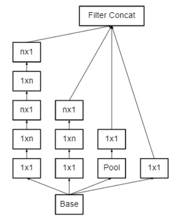
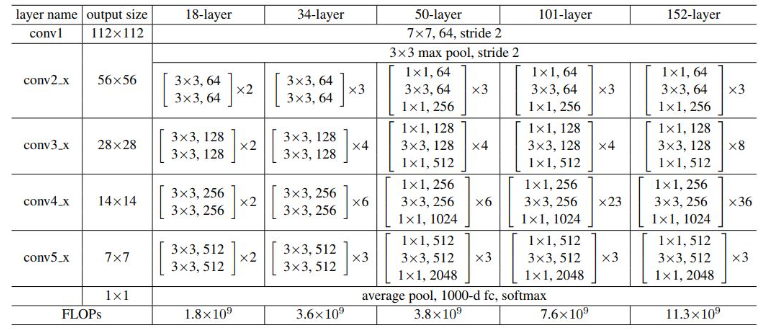
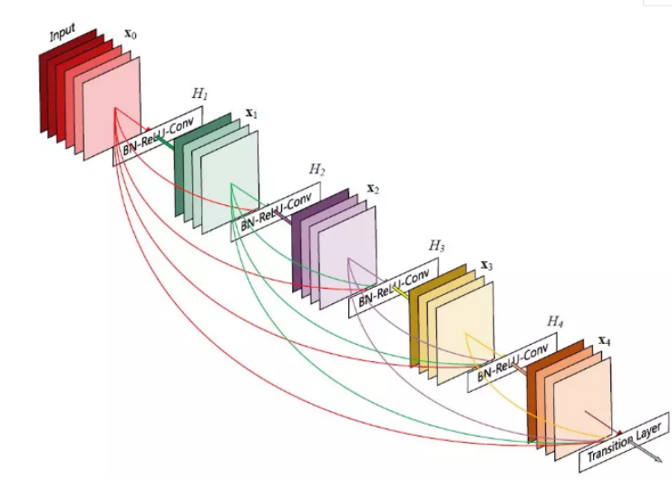
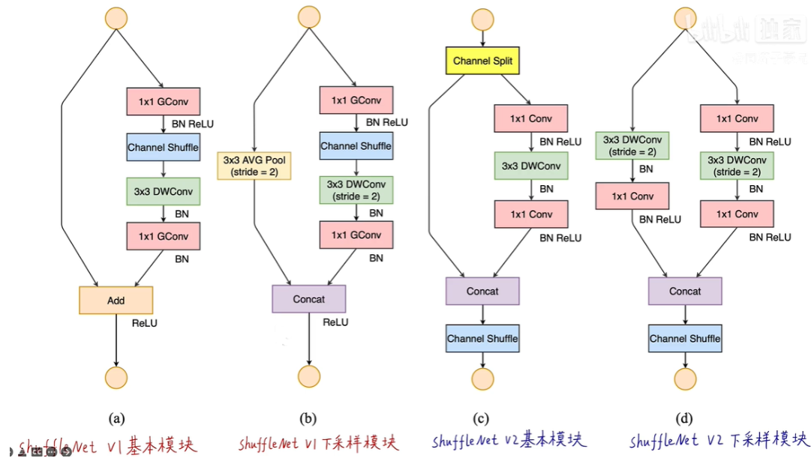
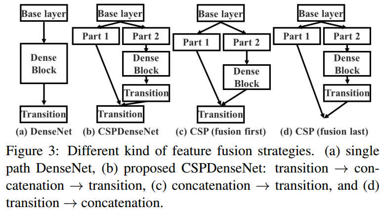

# 分类算法总结
+ 基于暑期实习生吴兴龙的工作
## 算法
### GoogleNet
+ 1、Inception模块：
+ 
+ 通过并行使用多个卷积和池化操作来提取特征，然后将这四个操作的输出进行通道维度的拼接，这样获得的图像是经过不同核大小的卷积提取的特征，有利于捕捉不同尺度的特征。
+ 1x1卷积核用于学习通道间的线性关系和降维。
+ 3x3卷积核用于捕捉局部特征和空间相关性。
+ 5x5卷积核用于学习更大范围的特征。
+ 最大池化用于捕捉局部的空间不变性。
+ 2、v2改进：在3x3卷积和5x5的卷积之前加入1x1的卷积进行降维，使用全局平均池化代替全连接层，以减小参数量
+ 
+ 3、v3改进：采用1×n和n×1的卷积核来代替InceptionV1-V2中n×n的卷积核（提取特征图的高的特征，以及特征图的宽的特征）
+ 
+ 4、辅助分类器:
+ 为了避免梯度消失，用于向前传导梯度；将中间某一层输出用作分类，起到模型融合作用；防止过拟合；
### ResNet
+ 残差连接，可以有效防止梯度消失和梯度爆炸问题；在残差块中使用了两个相同输出通道数的3x3卷积，可以提取更丰富的特征信息；使用1x1降低通道数，减少模型的参数量。
+ 
### MobileNet
+ 深度可分离卷积=深度卷积+逐点卷积；
+ v2改进：ReLU6、倒残差结构：先使用1x1升维，在进行3x3卷积，然后使用1x1降维；
+ v3改进：NAS（网络结构搜索），可以通过计算机来实现最优的参数设定，通过比较不同参数的网络模型效果，从而选择最优的参数设置；SE模块：首先是将特征图的每个通道都进行平均池化，然后进行两个全连接层得到一个输出结果，这个结果会和原始的特征图进行相乘，得到新的特征图；h-swish
### SENet
+ 注意力机制：将CxWxH的特征图转变为C1xWxH的特征图后，分为两路，一路进行平均池化和两个全连接层、两个激活函数得到1x1xC1，与另一路得到的C1xWxH进行相乘，1x1xC1的可以看成是权重，完成对原始特征的重校准；
+ 结构参考ResNet的图，输出添加个SE注意力模块；
### ResNeXt
+ 分组卷积,结合了VGG、ResNet以及Inception的优秀思想;实际上分组卷积和深度卷积的实现是相同的，仅仅是group的个数与输入channel的个数是否相同的区别；
+ 和resnet结构一样，参数量非常大；
### DenseNet
+ 残差连接思想：将每个DenseBlock内部的DenseLayer进行连接，进行多尺度的特征融合，将相同尺度的特征图融合可以有利于训练和参数压缩；本质就是Dense_Layer用的concat；
+ 
### VGG
+ 主要使用3x3的小卷积核，利用两个3x3的代替一个5x5的卷积核，三个3x3的代替一个7x7的卷积核，不仅减少了计算量，还是模型层次变得更深。
### ShuffleNet
+ 分组卷积+通道洗牌
+ v2改进：输入输出通道相同+分组不宜过大+减少碎片化操作+减少逐元素操作
+ 
### CSPNet
+ 在DenseNet基础上加分割特征图的操作
+ 
### EfficientNet
+ 混合缩放：把网络缩放的三种方式：深度、宽度、分辨率，组合起来按照一定规则缩放，对于更高分辨率的图像，应该增加网络深度和宽度。
+ v2：将MBConv模块的1×1和DW conv融合为了一个3×3卷积；正则化强弱与图像尺寸成正比；
## 数据集
+ CFIAR10：60000张32*32的RGB图像、10个类别；
+ CIFAR100、mini-ImageNet；
+ 直接在torchvision中可以下载，下载为二进制数据，可以用transfer.py转成jpg图片；
## 图形化：
+ GUI.py用于创建pyqt界面，读取文件和预测功能采用不同的线程执行。该文件会在PyQt_predict.py中调用。
+ PyQt_predict.py用于生成界面进行预测。
